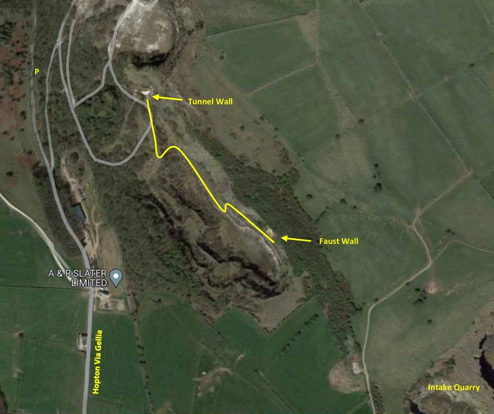

New developments and cleaning up of old routes have made this neglected quarry worth a visit. The approach in the Peak South Limestone guide is best not used and as with other venues in the area it is best to keep a low profile. The quarry is popular with walkers and parking is limited. Probably best to avoid on weekends.

The 2 walls come into the sun by around 11 and it can become very hot.

## Approach

The quarry is just a couple of miles NW of Wirksworth.

When approaching from the north head south on the A6 passing through Matlock and Matlock Bath and turn R at the traffic lights into Cromford. After 160m turn R onto the A5012 (Water Lane / Via Gellia). Follow this for 2.5 miles then turn L and head up the hill towards Hopton. Before the old quarry gate is reached (and before Arm Lees Farm) there is a layby with parking for 3 cars. A vague path leads up to the main quarry track. Zigzag up the quarry cracks and Tunnel Wall will come into view above the ventilation level (to Middleton Mine).

For Faust Wall, continue along a good path until a track leads off to the left down into the quarry and head straight back up and contour around the quarry rim until a cairn is reached and a steep slope leads up to the higher tier. Walk along this past the rockfall until Faust is reached. 10 mins from the car.

 
 
