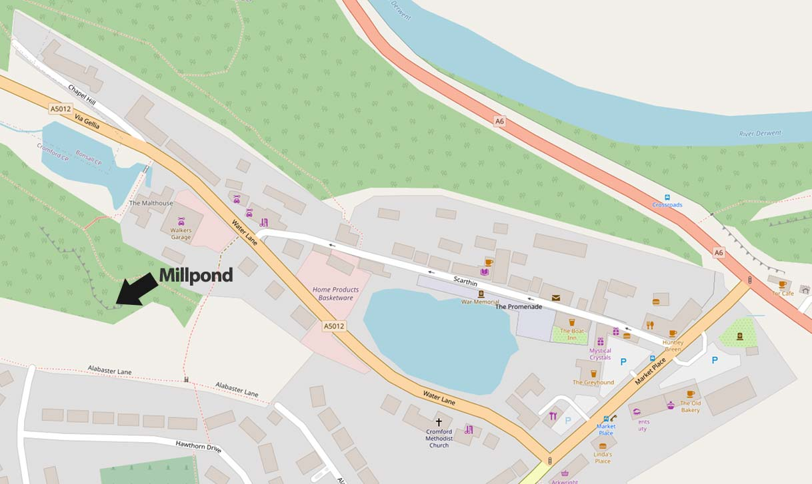
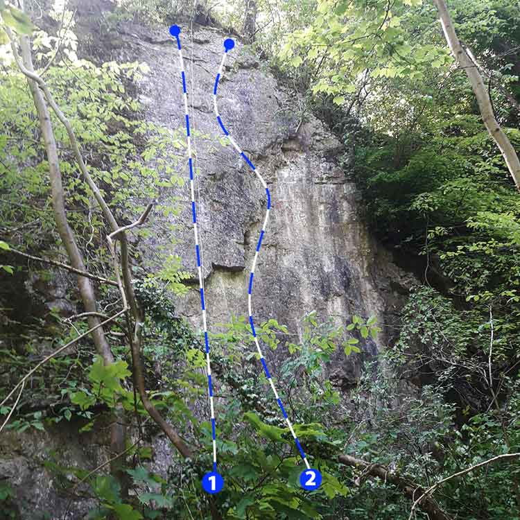
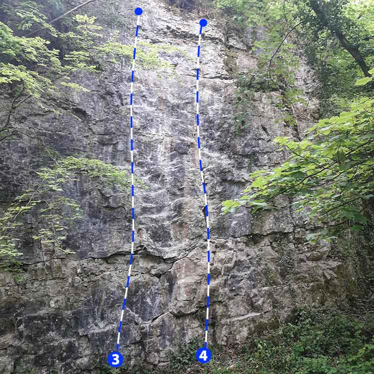

A small crag in Cromford was recently equipped. The crag faces North and is tree shrouded making it good for hot weather.

It's behind the Millpond on the A5012. Park on the main road near Walkers Garage and follow the footpath next to the garage towards Hawthorn Drive and turn right into the trees. Approach time from the main road is around 3 minutes.

## Approach

When travelling South on the A6 go through Matlock and Matlock Bath then turn right at the traffic lights for Wirksworth (B5036). Take the second on the right into Water Lane (A5012) and park on the road after about half a mile near the Walkers Garage. Follow the footpath next to the garage towards Hawthorn Drive and turn right into the trees. 

It's about 3 minutes from the main road.

The wall is on land owned by the Arkwright society. Keep a low profile and be respectful. 

## The routes

**1. Oliver Cromford (7b)** Thin and Technical.

**2. One Bolt for the Old (6b+)** Re-geared version of a lost classic by Dean Smart from 1991. Good, interesting route.

**Pissy Shunt (6b+)** the line right of *One Bolt..* .

**Pondering (6c)** takes a line left of *Pondlife*.

**3. Pondlife (6b)** Good, sustained route.

**4. The Cromford Variant (6b)** The crack maintains interest.